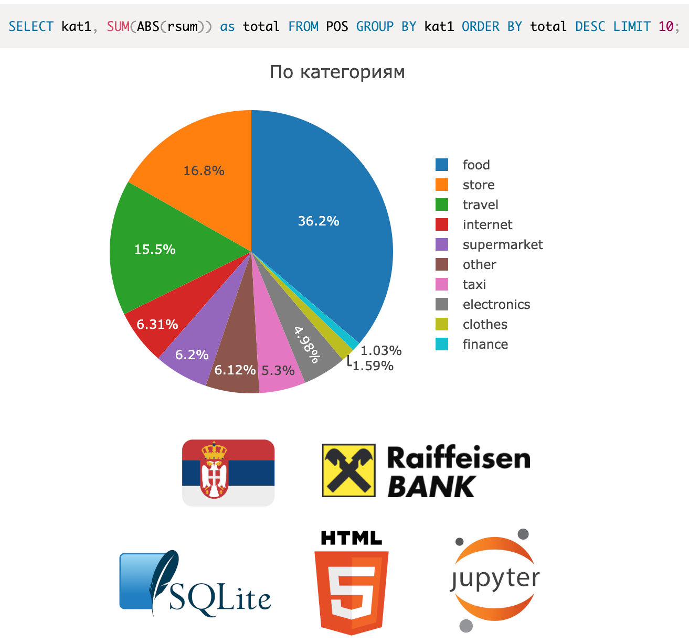

## RtxData - Анализ данных из Райфайзен Банка (Сербия)

- Безопасный: Для выгрузки данных не нужно отдавать пароль или токен
- Приватный: Данные остаются на устройстве
- Удобный: Работает в браузере



### Скачиваем свои данные

#### Удобный способ (Райфайзен, Вольт)

1) Открываем Chrome/Yandex/Chromium
2) Устанавливаем расширение [[beta] RtxData Assistant](https://chrome.google.com/webstore/detail/beta-rtxdata-assistant/djmfdajhgfpglhghcmapiannlloimpib)
3) Открываем https://rtxdata.github.io/
4) Жмем `Загрузить с raiffeisenbank.rs` / `Загрузить с wolt.com`
5) Логинимся
6) Выгрузка в rtxdata начнется автоматически

#### Верифицируемый способ (Райфайзен)

1) Логинимся в личном кабинете https://rol.raiffeisenbank.rs/Retail/Home/Login
2) Открываем консоль разработчика, в Chrome/Yandex/Firefox это `F12` или `Cmd + Opt + I`
3) Вставляем в консоль скрипт
```javascript
// Берем транзакции за 2023 год
filter = '"filterParam":{"FromDate":"01.01.2023","ToDate":"01.01.2024"}'

// URL фронтового API Райфа
base = "https://rol.raiffeisenbank.rs/Retail/Protected/Services/DataService.svc/"
// Получаем банковские счета
accounts = await fetch(base + "GetAllAccountBalance",
    { body: '{"gridName":"RetailAccountBalancePreviewFlat-L"}', 
    method: "POST" }).then(res => res.json());

// Получаем транзакции
transactions = {};
for (number of new Set(accounts.map(a => a[1]))) {
    // Скачиваем информацию о транзакции
    transactions[number] = await fetch(base + "GetTransactionalAccountTurnover", {
        body: '{"gridName":"RetailAccountTurnoverTransactionPreviewMasterDetail-S",' +
            '"productCoreID":"541","accountNumber":"' + number + '",' + filter + '}',
            method: "POST"}).then(res => res.json());
}

// Сохраняем транзакции как файл
element = document.createElement('a');
// Кодируем данные
element.href = URL.createObjectURL(new Blob([JSON.stringify({ transactions })],
    { type: "application/json" }));
// Сохраняем в загрузки
element.download = 'Raiff_2023_' + new Date().toISOString() + '.json';
element.click();
```
4) Ожидаем скачивания файла с транзакциями за 2023 год

### Строим графики, круговые диаграммы и таблицы

1) Заходим https://rtxdata.github.io
2) Открываем полученный `Raiff.json` и смотрим аналитику

### Пишем кастомные SQL запросы

1) Клонируем и устанавливаем пакеты в venv
```bash
git clone git@github.com:rtxdata/rtxdata.github.io.git
python3.9 -m venv .venv
. ./.venv/bin/activate
pip install -r requirements.txt
```
2) Кладем полученный `Raiff.json` в папку с репозиторием
3) Запускаем `jupyter notebook` или открываем `RtxData.ipynb` в VSCode с расширением Jupyter Notebook
4) Запускаем ячейки, запросы можно редактировать

#### Какой график получится?

- Круговая диаграмма будет построена если выбраны 2 колонки и вторая называется `total`
- Линия по датам будет построена если выбраны 2 колонки и первая называется `date`
- Таблица будет построена в остальных случаях

### Добавляем графики и пополняем классификатор

1) Запросы находятся в `dashboard.sql`, `init` выполняется перед всеми и нужен для вспомогательных таблиц
2) Классификатор находится в `patterns.json` и работает как паттерн матчинг, поддерживается только 2 уровня вложенности
3) Пожалуйста отправьте пулл реквест с новыми графиками и обновлениями классификатора если найдете что-то полезное для себя

### Скачиваем заказы Вольта

1) Логинимся https://wolt.com/
2) Открываем консоль разработчика, в Chrome/Yandex/Firefox это `F12` или `Cmd + Opt + I`
3) Вставляем в консоль скрипт
```javascript
token = decodeURIComponent(document.cookie).match(/__wtoken=[^,]+,"accessToken":"([^"]+)/)[1];
orders = [];

for (let skip = 0; ; skip += 100) {
    batch = await fetch("https://restaurant-api.wolt.com/v2/order_details/?limit=100&skip=" + skip,
        { headers: { authorization: "Bearer " + token } }).then(res => res.json());
    orders.push(...batch);
    if (batch.length === 0) { break; }
}

element = document.createElement('a');
element.href = URL.createObjectURL(new Blob([JSON.stringify({ orders })],
    { type: "application/json" }));
element.download = 'Wolt_' + new Date().toISOString() + '.json';
element.click();
```

### Скачиваем заказы Глово

1) Логинимся https://glovoapp.com/
2) Открываем консоль разработчика, в Chrome/Yandex/Firefox это `F12` или `Cmd + Opt + I`
3) Вставляем в консоль скрипт
```javascript
authorization = decodeURIComponent(document.cookie).match(/glovo_auth_info={"accessToken":"([^"]+)/)[1]
glovo = [];
batch = await fetch("https://api.glovoapp.com/v3/customer/orders-list?offset=0&limit=10000",
    { headers: { accept: "application/json", authorization } }).then(res => res.json());

for (let i = 0; i < batch.orders.length; i++) {
    order = await fetch("https://api.glovoapp.com/v3/customer/orders/" + batch.orders[i].orderId,
        { headers: { accept: "application/json", authorization } }).then(res => res.json());
    glovo.push(order);
}

element = document.createElement('a');
element.href = URL.createObjectURL(new Blob([JSON.stringify({ glovo })],
    { type: "application/json" }));
element.download = 'Glovo_' + new Date().toISOString() + '.json';
element.click();
```

### Найдена уязвимость, куда писать?

https://t.me/enovikov11

### Одна логика реализована на двух языках

Код `index.html` и `utils.py` похож и использует одинаковые библиотеки насколько это возможно, чтобы использовать сильные стороны языков:
- JavaScript работает в браузере на смартфонах, компьютерах, не нужно устанавливать, упор на UI/UX
- В Python удобно экспериментировать с данными и писть SQLки, есть хорошие библиотеки вроде Numpy и Pandas

### Можно ли выполнять кастомные запросы в браузере?

Для этого есть кнопка `Выполнить SQL`
