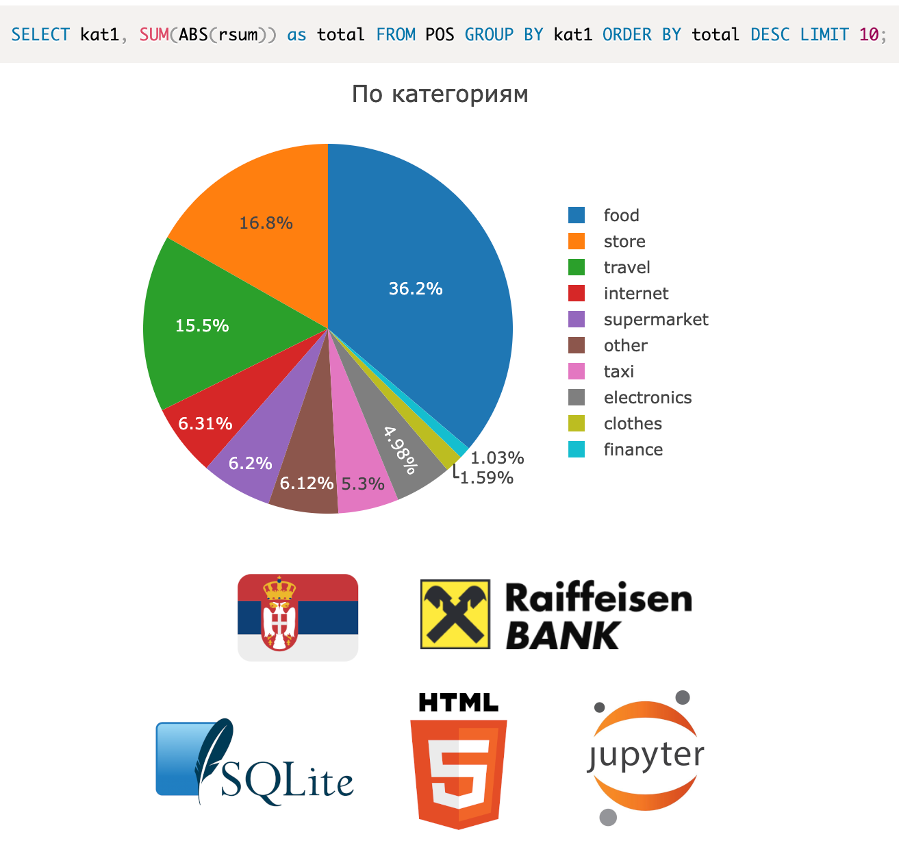

## RtxData - Анализ данных из Райфайзен Банка (Сербия)

- Безопасный: Для выгрузки данных не нужно отдавать пароль или токен
- Приватный: Данные остаются на устройстве
- Удобный: Работает в браузере



### Скачиваем свои данные

#### Удобный способ на компе или Android (Райфайзен, Вольт)

1) Открываем Chrome/Yandex/Chromium на компе или Yandex Browser на Android
2) Устанавливаем расширение [[beta] RtxData Assistant](https://chrome.google.com/webstore/detail/beta-rtxdata-assistant/djmfdajhgfpglhghcmapiannlloimpib)
3) Открываем https://rtxdata.github.io/
4) Жмем `Загрузить с raiffeisenbank.rs` / `Загрузить с wolt.com`
5) Логинимся
6) Выгрузка в rtxdata начнется автоматически

#### Верифицируемый способ (Райфайзен)

1) Логинимся в личном кабинете https://rol.raiffeisenbank.rs/Retail/Home/Login
2) Открываем консоль разработчика, в Chrome/Yandex/Firefox это `F12` или `Cmd + Opt + I`
3) Вставляем в консоль скрипт
```javascript
// Берем транзакции за последние 365 дней
formatter = new Intl.DateTimeFormat('ru-RU');
fromDate = formatter.format(new Date() - 365 * 24 * 60 * 60 * 1000);
toDate = formatter.format(new Date());
filter = `"filterParam":{"FromDate":"${fromDate}","ToDate":"${toDate}"}`;

// URL фронтового API Райфа
base = "https://rol.raiffeisenbank.rs/Retail/Protected/Services/DataService.svc/";
// Получаем банковские счета
accounts = await fetch(base + "GetAllAccountBalance",
    { body: '{"gridName":"RetailAccountBalancePreviewFlat-L"}', 
    method: "POST" }).then(res => res.json());

// Получаем транзакции
transactions = {};
for (number of new Set(accounts.map(a => a[1]))) {
    // Скачиваем информацию о транзакции
    transactions[number] = await fetch(base + "GetTransactionalAccountTurnover", {
        body: '{"gridName":"RetailAccountTurnoverTransactionPreviewMasterDetail-S",' +
            '"productCoreID":"541","accountNumber":"' + number + '",' + filter + '}',
            method: "POST"}).then(res => res.json());
}

// Сохраняем транзакции как файл
element = document.createElement('a');
// Кодируем данные
element.href = URL.createObjectURL(new Blob([JSON.stringify({ transactions })],
    { type: "application/json" }));
// Сохраняем в загрузки
element.download = 'Raiff_' + new Date().toISOString() + '.json';
element.click();
```
4) Ожидаем скачивания файла с транзакциями

### Смотрим аналитику

1) Заходим на https://rtxdata.github.io
2) Жмём «Импортировать файл» и открываем полученный `Raiff_*.json` (или подгружаем данные расширением)
3) Изучаем по вкладкам:
   - **Обзор** — доходы / расходы / баланс и норма сбережений по месяцам, динамика, что изменилось
   - **Транзакции** — список операций с поиском и фильтрами; переключатель «реальные траты ⟷ все движения» отделяет покупки от обменов валют, снятий и переводов; категоризация в один клик
   - **По категориям** — траты по выбранной категории помесячно, со средним и разбивкой по подкатегориям
   - **Правила** — редактор правил категоризации (маска-подстрока или `/regex/`, просмотр совпадений, удаление)
   - **Оптимизация** — найденные регулярные платежи и подписки

Данные не покидают браузер.

### Разработка нового интерфейса (`app/`)

Текущий интерфейс — приложение на **Vite + React + TypeScript** в папке `app/` (оно заменяет прежнее приложение на Create React App, которое осталось в корне репозитория). Данные по-прежнему хранятся только в `localStorage`, без обращений к сети в рантайме.

```bash
cd app
npm install
npm run dev        # дев-сервер
npm run build      # сборка (tsc + vite), деплоится содержимое app/dist
npm run test:run   # тесты (Vitest)
```

Стек: Vite 5, React 18, TypeScript, Tailwind v4, shadcn/ui, TanStack Table/Virtual, Recharts. Логика разбора и классификации продублирована на TypeScript в `app/src/lib/*` (рядом с `src/db.js` и `utils.py`) — при изменении схемы держите все три в синхроне: курсы валют и индексы полей должны совпадать. Подробности в `CLAUDE.md`.

### Пишем кастомные SQL запросы

1) Клонируем и устанавливаем пакеты в venv
```bash
git clone git@github.com:rtxdata/rtxdata.github.io.git
python3.9 -m venv .venv
. ./.venv/bin/activate
pip install -r requirements.txt
```
2) Кладем полученный `Raiff.json` в папку с репозиторием
3) Запускаем `jupyter notebook` или открываем `RtxData.ipynb` в VSCode с расширением Jupyter Notebook
4) Запускаем ячейки, запросы можно редактировать

#### Какой график получится?

- Круговая диаграмма будет построена если выбраны 2 колонки и вторая называется `total`
- Линия по датам будет построена если выбраны 2 колонки и первая называется `date`
- Таблица будет построена в остальных случаях

### Добавляем графики и пополняем классификатор

1) Запросы находятся в `dashboard.sql`, `init` выполняется перед всеми и нужен для вспомогательных таблиц
2) Классификатор находится в `patterns.json` и работает как паттерн матчинг, поддерживается только 2 уровня вложенности
3) Пожалуйста отправьте пулл реквест с новыми графиками и обновлениями классификатора если найдете что-то полезное для себя

### Безопасность данных

- Приложение хранит данные в [localStorage](https://learn.javascript.ru/localstorage)
- На странице задана [Content Security Policy](https://developer.mozilla.org/ru/docs/Web/HTTP/CSP), она ограничивает код выполняемый в браузере по приницу "запрещено все, что не разрешено явно"
- Страница не использует куки
- В HTML коде не установлено трекеров (GitHub и Cloudflare технически доступен факт визита, но не сами данные; они нужны, тк являются инфраструктурой)
- Владелец этого репозитория использует защищенный паролем ssh ключ и двухфакторную аутентификацию

#### Найдена уязвимость, куда писать?

https://t.me/enovikov11

#### Используемая инфраструктура

Приложение использует GitHub Pages для хостинга и Cloudflare в качестве CDN. Их политики приватности можно найти по ссылкам:
- https://docs.github.com/en/site-policy/privacy-policies/github-privacy-statement
- https://www.cloudflare.com/privacypolicy/

#### npm audit показывает 8 уязвимостей, мне есть о чем беспокоиться?

Не беспокойтесь, все ок:  

Проблемы в пакетах `nth-check` и `postcss` не затрагивают безопасность обработки данных, они потенциально могли бы привести к зависанию кода, но тк эти известные уязвимости в dev зависимостях `react-scripts`, они могут проявиться только на этапе сборки. Кроме того для их эксплуатации необходимо передать специально сформированные данные, которых в исходниках нет

### Скачиваем транзакции с бизнес счёта

Спасибо @meaning за помощь с раздебагом бизнес счетов

```javascript
// URL фронтового API Райфа
base = "https://rol.raiffeisenbank.rs/CorporateV4/Protected/Services/DataServiceCorporate.svc/";
// Получаем банковские счета
accounts = await fetch(base + "GetAllAccountBalance",
    { body: '{"gridName":"AccountBalancePreview"}', 
    method: "POST" }).then(res => res.json());
    
// Берем транзакции за последние 365 дней
formatter = new Intl.DateTimeFormat('ru-RU');
fromDate = formatter.format(new Date() - 365 * 24 * 60 * 60 * 1000);
toDate = formatter.format(new Date());

// Получаем транзакции
transactions = {};

for (account of accounts[3].filter(e=>e.ShortAccountNumber)) {
  accountNumber = account.ShortAccountNumber;
  
  if (account.CurrencyCode == "RSD") {
    // Скачиваем информацию о RSD транзакциях
    filter = `"filterParam":{"FromDate":"${fromDate}","ToDate":"${toDate}"}`;
    transactions[accountNumber + "_RSD"] = await fetch(base + "GetAccountTurnoverDomesticRzbSrb", {
        body: '{"gridName":"AccountTurnoverDomesticMasterDetail-L",' +
            '"productCoreID":"501","accountNumber":"' + accountNumber + '",' + filter + '}',
            method: "POST"}).then(res => res.json());
  } else {
    // Скачиваем информацию о non-RSD транзакциях
    filter = `"filterParam":{"accountNumber":"${accountNumber}","CurrencyCodeNumeric":"${account.CurrencyCodeNumeric}","FromDate":"${fromDate}","ToDate":"${toDate}"}`;
    transactions[accountNumber + "_" + account.CurrencyCodeNumeric] = await fetch(base + "GetAccountTurnover", {
        body: '{"gridName":"AccountTurnoverForeignMasterDetail-M",' +
            '"productCoreID":"120","accountNumber":"' + accountNumber + '",' + filter + '}',
            method: "POST"}).then(res => res.json());
  }
}

// Сохраняем транзакции как файл
element = document.createElement('a');
// Кодируем данные
element.href = URL.createObjectURL(new Blob([JSON.stringify({ transactions })],
    { type: "application/json" }));
// Сохраняем в загрузки
element.download = 'Raiff_Business_' + new Date().toISOString() + '.json';
element.click();
```

### Скачиваем заказы Вольта

1) Логинимся https://wolt.com/
2) Открываем консоль разработчика, в Chrome/Yandex/Firefox это `F12` или `Cmd + Opt + I`
3) Вставляем в консоль скрипт
```javascript
token = JSON.parse(decodeURIComponent(document.cookie.split("__wtoken=")[1].split("; ")[0])).accessToken;
orders = [];

for (let skip = 0; ; skip += 100) {
    batch = await fetch("https://restaurant-api.wolt.com/v2/order_details/?limit=100&skip=" + skip,
        { headers: { authorization: "Bearer " + token } }).then(res => res.json());
    orders.push(...batch);
    if (batch.length === 0) { break; }
}

element = document.createElement('a');
element.href = URL.createObjectURL(new Blob([JSON.stringify({ orders })],
    { type: "application/json" }));
element.download = 'Wolt_' + new Date().toISOString() + '.json';
element.click();
```

### Скачиваем заказы Глово

1) Логинимся https://glovoapp.com/
2) Открываем консоль разработчика, в Chrome/Yandex/Firefox это `F12` или `Cmd + Opt + I`
3) Вставляем в консоль скрипт
```javascript
authorization = decodeURIComponent(document.cookie).match(/glovo_auth_info={"accessToken":"([^"]+)/)[1];
glovo = [];
batch = await fetch("https://api.glovoapp.com/v3/customer/orders-list?offset=0&limit=10000",
    { headers: { accept: "application/json", authorization } }).then(res => res.json());

for (let i = 0; i < batch.orders.length; i++) {
    order = await fetch("https://api.glovoapp.com/v3/customer/orders/" + batch.orders[i].orderId,
        { headers: { accept: "application/json", authorization } }).then(res => res.json());
    glovo.push(order);
}

element = document.createElement('a');
element.href = URL.createObjectURL(new Blob([JSON.stringify({ glovo })],
    { type: "application/json" }));
element.download = 'Glovo_' + new Date().toISOString() + '.json';
element.click();
```

### Одна логика реализована на нескольких языках

Разбор и классификация данных намеренно продублированы, чтобы использовать сильные стороны каждого окружения:
- **TypeScript** (`app/src/lib/*`) — новый интерфейс в браузере, упор на UI/UX, без установки
- **JavaScript** (`src/db.js`) — прежнее приложение
- **Python** (`utils.py`, `RtxData.ipynb`) — удобно экспериментировать с данными и писать SQL, есть Numpy и Pandas

При изменении схемы или парсинга правьте все актуальные реализации синхронно (курсы валют и индексы полей должны совпадать).

### Можно ли выполнять кастомные запросы в браузере?

Для этого есть кнопка `Выполнить SQL`
